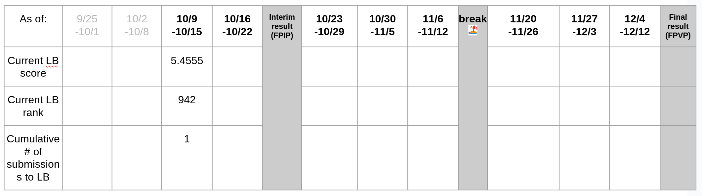

# DNN-Final-Project

## Preprocessing

### Missing Value Handling:
- **Interpolation:** Fill missing values with interpolated data based on nearby points.
- **Forward Fill or Backward Fill:** Fill gaps with the previous (or next) non-null value.
- **Drop:** Simply remove missing values if they are few.
- **Impute:** Use statistical methods (like mean, median) or models to estimate missing values.

### Outliers Detection and Treatment:
- **Visual Inspection:** Using plots to detect anomalies.
- **Statistical Tests:** e.g., Z-scores, IQR.
- **Treatment:** Cap, replace, or remove outliers, depending on the context.

### Decomposition:
- **Trend:** Removing or accounting for the underlying trend in the data.
- **Seasonality:** Adjusting for recurring patterns or cycles.
- **Residual:** The remainder of the time series after removing trend and seasonality.

### Stationarity:
- **Differencing:** Taking the difference with a previous observation.
- **Transformation:** e.g., logarithm, square root.
- **Ad Fuller Test:** To check for stationarity.

### Detrending:
- Remove trends from data to make it more stationary. Common methods include differencing and regression.

### Normalization/Standardization:
- **Min-Max Scaling:** Transforms data to range [0, 1].
- **Z-score Normalization:** Mean of 0 and standard deviation of 1.

### Feature Engineering:
- **Lagged Features:** Use previous time steps as features.
- **Rolling Window Statistics:** E.g., rolling mean, rolling standard deviation.
- **Domain-specific Features:** Extracted based on domain knowledge.

### Handling Unevenly Spaced Observations:
- **Resampling:** Change the frequency of the data (e.g., from daily to monthly).
- **Aggregating:** Summarizing data over a specific interval.

### Encoding Cyclical Features:
- For time-based features like hour of the day, day of the week, or month of the year, use sin/cos transformations to encode them so the model captures the cyclicity.

### Temporal Split:
- When splitting data into training and test sets, always ensure it's done temporally. This means that the future is never used to predict the past.

### Removing Noise:
- **Smoothing:** Techniques like moving average can help reduce noise.
- **Wavelet Denoising:** Useful for certain types of data.

## Characteristics

- **Trend:** Over longer periods, stocks and indices may exhibit upward (bull market) or downward (bear market) trends.
- **Seasonality:** Certain stocks or sectors might exhibit recurring patterns or cycles.
- **Volatility:** Stock prices can be volatile.
- **Correlation:** The movement of individual stocks in relation to the synthetic index.
- **Noise:** Random fluctuations in stock prices.
- **Unexpected Events:** Sudden events affecting stock prices.
- **Feedback Loops:** Reinforcing price movements.
- **Liquidity:** Variation in stock liquidity.
- **Earning Reports & Dividends:** Influence on stock prices.
- **Economic Indicators:** Broader economic factors affecting stock prices.
- **Sector-Specific Movements:** Unified sectoral price movements.
- **Lagged Reactions:** Delayed stock or market reactions.

## Correlations:

### Strong Positive Correlations (close to 1):
- `reference_price` has a strong positive correlation with `matched_size`, `bid_price`, `ask_price`, and `vwap`.
- `bid_price` and `bid_size` show a strong positive correlation.
- `ask_price` and `ask_size` are also positively correlated.
- `near_price` and `far_price` have a strong positive correlation.

### Strong Negative Correlations (close to -1):
- `reference_price` and `ask_size` exhibit a strong negative correlation.

### Moderate Correlations:
- `imbalance_size` has a moderate positive correlation with variables like `imbalance_buy_sell_flag` and `near_price`.

### Weak Correlations:
- Variables like `stock_id`, `seconds_in_bucket`, `date_id`, and `time_id` show very weak correlations with most other variables.

## Links:
- [Competition](https://www.kaggle.com/competitions/optiver-trading-at-the-close)
- [GitHub Repository](https://github.com/cvaisnor/DNN-Final-Project)
- [Google Slides Presentation](https://docs.google.com/presentation/d/1Xc5F1_NveFi1il3GqHej2aqVmklR_jZU4kx6ZJhiDEM/edit?usp=sharing)
- [***DONT USE*** - Google Slides Presentation Week 8 - ***DONT USE***](https://docs.google.com/presentation/d/1C3Ci4o3c2e_eLcuDNhF5jlLPaHYleNkZZpoKyBaXnHQ/edit?usp=sharing)

## Repository Structure:
- `/images` - contains images used in README.md
- `/reference_notebooks` - contains public notebooks from the competition

### Ignored data files:
The below folder should contain the unzipped data files from the competition. The folder is ignored by git to avoid uploading large files to the repository. The folder structure should be as follows:
- `/kaggle/input/optiver-trading-at-the-close/`
  - `/example_test_files`
  - `/optiver2023`
  - `train.csv`
  - `public_timerseries_testing_util.py`

## TODO:
- Exploratory Data Analysis

## Target CSV

## Score Slide as of 10/10/23:

